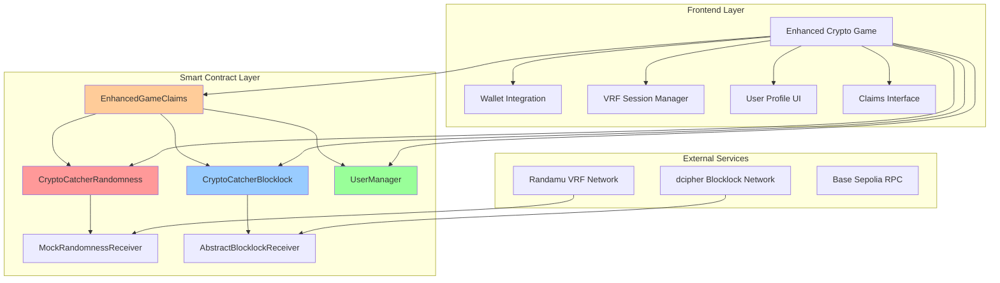
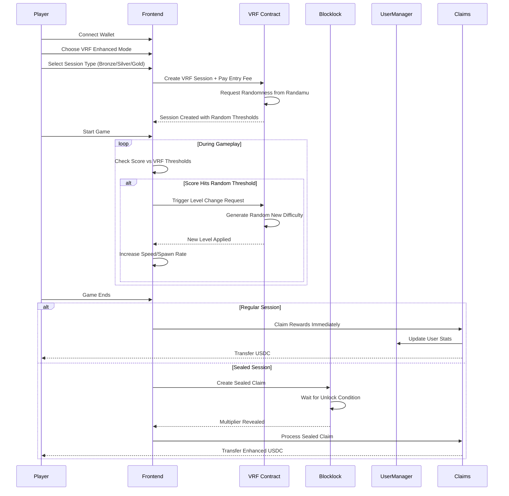

# 🎮 Crypto Catcher VRF Enhancement - Technical Guide

## 📋 Table of Contents
1. [Project Overview](#project-overview)
2. [Architecture](#architecture)
3. [Smart Contracts](#smart-contracts)
4. [VRF Integration](#vrf-integration)
5. [Blocklock System](#blocklock-system)
6. [User Management](#user-management)
7. [Game Logic](#game-logic)
8. [Deployment Guide](#deployment-guide)
9. [Usage Examples](#usage-examples)

---

## 🎯 Project Overview

### What is Enhanced Crypto Catcher?

Enhanced Crypto Catcher transforms the original token-catching game into a **provably fair, blockchain-powered gaming experience** using:

- **🎲 VRF (Verifiable Random Functions)** for unpredictable gameplay mechanics
- **🔐 Blocklock Conditional Encryption** for sealed reward multipliers  
- **👥 User Management System** with profiles, achievements, and leaderboards
- **💰 Enhanced Claims System** with encrypted multipliers and level bonuses

### Key Innovations

#### **1. VRF-Powered Random Level Changes**
- **Problem Solved**: Players could predict and exploit fixed difficulty patterns
- **Solution**: VRF generates random score thresholds where game difficulty changes unpredictably
- **Result**: True unpredictability that cannot be gamed or manipulated

#### **2. Sealed Session Multipliers** 
- **Problem Solved**: Players knew their potential rewards upfront
- **Solution**: Reward multipliers are encrypted using blocklock and revealed after gameplay
- **Result**: Creates suspense, prevents reward farming, ensures fair distribution

#### **3. Provable Fairness**
- **Problem Solved**: Players couldn't verify game randomness was fair
- **Solution**: All randomness comes from VRF with cryptographic proofs
- **Result**: Players can independently verify all random events

---

## 🏗️ Architecture



## 🔗 Smart Contracts

### 1. CryptoCatcherRandomness.sol

**Purpose**: Manages VRF-powered game sessions and random level changes

```solidity
contract CryptoCatcherRandomness is RandomnessReceiverBase {
    struct GameSession {
        address player;
        uint256 requestId;
        bytes32 sessionSeed;
        uint256 entryFee;
        uint256 startTime;
        uint256 baseMultiplier;
        uint256[] levelChangeThresholds;  // VRF-generated thresholds
        uint256[] levelDifficulties;     // VRF-generated difficulties
        bool isActive;
        bool seedReceived;
    }
}
```

#### Key Functions:

**Session Creation**:
```solidity
function createGameSession(SessionType sessionType, uint32 callbackGasLimit) 
    external payable returns (uint256 sessionId, uint256 requestPrice);
```
- Creates a new VRF-powered game session
- Generates random level change thresholds using VRF
- Supports 5 session types: FREE, BRONZE, SILVER, GOLD, PLATINUM

**Level Change Requests**:
```solidity
function requestLevelChange(uint256 sessionId, uint256 currentScore, uint32 callbackGasLimit) 
    external payable returns (uint256 requestId, uint256 requestPrice);
```
- Triggered when player reaches a random threshold
- Uses VRF to determine new difficulty level (1-10)
- Cannot be predicted or manipulated

**Session Types & Rewards**:
```typescript
const sessionConfigs = {
  FREE: { entryFee: 0, baseMultiplier: 100, maxLevelChanges: 2 },
  BRONZE: { entryFee: 0.001, baseMultiplier: 120, maxLevelChanges: 3 },
  SILVER: { entryFee: 0.005, baseMultiplier: 150, maxLevelChanges: 4 },
  GOLD: { entryFee: 0.01, baseMultiplier: 200, maxLevelChanges: 5 },
  PLATINUM: { entryFee: 0.025, baseMultiplier: 300, maxLevelChanges: 7 },
}
```

### 2. CryptoCatcherBlocklock.sol

**Purpose**: Handles conditional encryption for sealed sessions

```solidity
contract CryptoCatcherBlocklock is AbstractBlocklockReceiver {
    struct SealedSession {
        address player;
        uint256 sessionId;
        uint256 requestId;
        TypesLib.Ciphertext encryptedMultiplier;
        bytes condition;
        uint256 createdAt;
        uint256 unlockTime;
        bool isRevealed;
        uint256 revealedMultiplier;
        SealType sealType;
    }
}
```

#### Seal Types:

**Time-Based Seals**:
```solidity
function createTimeSealedSession(
    uint256 sessionId,
    uint256 unlockDelayMinutes,
    uint256 encryptedMultiplier,
    uint32 callbackGasLimit
) external payable returns (uint256 sealId, uint256 requestPrice);
```
- Multiplier revealed after specified time delay
- Creates anticipation and prevents immediate reward farming

**Block-Based Seals**:
```solidity
function createBlockSealedSession(
    uint256 sessionId,
    uint256 unlockBlock,
    uint256 encryptedMultiplier,
    uint32 callbackGasLimit
) external payable returns (uint256 sealId, uint256 requestPrice);
```
- Multiplier revealed after specific block height
- More predictable than time-based for planning

### 3. UserManager.sol

**Purpose**: Complete user profile and achievement system

```solidity
struct UserProfile {
    string username;
    address walletAddress;
    uint256 totalScore;
    uint256 bestSingleScore;
    uint256 gamesPlayed;
    uint256 totalTokensCollected;
    uint256 totalClaimsAmount;
    uint256 registrationTime;
    bool isActive;
    uint8 level;        // User level 1-100
    uint256 experience; // XP points
}
```

#### Achievement System:

**Built-in Achievements**:
```typescript
const achievements = [
  { name: "First Game", requirement: 1, xpReward: 100 },
  { name: "Collector", requirement: 100, xpReward: 250 },
  { name: "High Scorer", requirement: 1000, xpReward: 500 },
  { name: "Veteran", requirement: 50, xpReward: 750 },
  { name: "Token Master", requirement: 1000, xpReward: 1000 },
  { name: "Elite Player", requirement: 25, xpReward: 2000 },
  { name: "Seal Breaker", requirement: 10, xpReward: 1500 }
]
```

**XP Calculation**:
```solidity
function _calculateXP(uint256 score, uint256 tokens, uint256 multiplier, bool isSealed) 
    internal pure returns (uint256) {
    uint256 baseXP = score / 10;                    // 1 XP per 10 points
    uint256 tokenBonus = tokens * 5;               // 5 XP per token
    uint256 multiplierBonus = (baseXP * multiplier) / 100;
    uint256 sealBonus = isSealed ? (baseXP * 20) / 100 : 0; // 20% bonus for sealed
    
    return baseXP + tokenBonus + multiplierBonus + sealBonus;
}
```

#### Leaderboard System:

**Three Leaderboard Types**:
```solidity
LeaderboardEntry[100] public allTimeLeaderboard;
LeaderboardEntry[100] public weeklyLeaderboard;
LeaderboardEntry[100] public dailyLeaderboard;
```

### 4. EnhancedGameClaims.sol

**Purpose**: Advanced reward system with encrypted multipliers

```solidity
struct ClaimRequest {
    address player;
    uint256 points;
    uint256 sessionId;
    uint256 baseReward;
    uint256 multiplier;
    bool isSealed;
    bool isClaimed;
    uint256 timestamp;
}
```

#### Reward Calculation:

**Multi-Layer Multiplier System**:
```solidity
function calculateTotalMultiplier(
    address player,
    uint256 sessionMultiplier,
    bool isSealed
) public view returns (uint256) {
    uint256 totalMultiplier = sessionMultiplier;  // VRF session multiplier
    
    // Sealed session bonus (+50%)
    if (isSealed) {
        totalMultiplier = (totalMultiplier * 150) / 100;
    }
    
    // User level bonus (2% per level, max 100%)
    if (userManager.isRegistered(player)) {
        UserManager.UserProfile memory profile = userManager.getUserProfile(player);
        uint256 levelBonus = min(profile.level * 2, 100);
        totalMultiplier = (totalMultiplier * (100 + levelBonus)) / 100;
    }
    
    return totalMultiplier;
}
```

**Claiming Process**:

1. **Regular Claims**: Immediate processing with known multipliers
2. **Sealed Claims**: Two-step process requiring blocklock reveal

```solidity
// Step 1: Create pending claim
function claimSealedRewards(uint256 points, uint256 sessionId) 
    external returns (uint256 claimId);

// Step 2: Process once multiplier revealed  
function processSealedClaim(uint256 claimId) external;
```

---

## 🎲 VRF Integration

### How VRF Powers Game Randomness

#### 1. Session Initialization
```typescript
// Frontend: Request VRF session
const createVRFSession = async (sessionType: keyof typeof sessionConfigs) => {
  const callbackGasLimit = 700_000
  const randomness = Randomness.createBaseSepolia(jsonProvider)
  const [requestCallBackPrice] = await randomness.calculateRequestPriceNative(BigInt(callbackGasLimit))
  
  writeContract({
    address: RANDOMNESS_CONTRACT_ADDRESS,
    abi: RANDOMNESS_CONTRACT_ABI,
    functionName: 'generateWithDirectFunding',
    args: [callbackGasLimit],
    value: requestCallBackPrice,
  })
}
```

#### 2. Random Threshold Generation
```solidity
// Contract: Generate level change thresholds from VRF
function _processSessionSeed(uint256 sessionId, bytes32 randomness) internal {
    GameSession storage session = sessions[sessionId];
    session.sessionSeed = randomness;
    
    uint256[] memory thresholds = new uint256[](5);
    uint256[] memory difficulties = new uint256[](5);
    
    bytes32 seed = randomness;
    for (uint256 i = 0; i < 5; i++) {
        seed = keccak256(abi.encode(seed, i));
        // Random thresholds: 100-300, 200-600, 300-900, etc.
        thresholds[i] = 100 * (i + 1) + (uint256(seed) % (200 * (i + 1)));
        // Random difficulty levels 1-10
        difficulties[i] = 1 + (uint256(keccak256(abi.encode(seed, "difficulty"))) % 10);
    }
    
    session.levelChangeThresholds = thresholds;
    session.levelDifficulties = difficulties;
}
```

#### 3. Gameplay Integration
```typescript
// Frontend: Check for level changes during gameplay
const triggerLevelChange = (currentScore: number) => {
  if (!currentSession) return
  
  const nextLevel = currentGameLevel + 1
  setCurrentGameLevel(nextLevel)
  setLevelChangeEffect(true)
  
  // Visual feedback
  toast.success(`🎮 Level Up! Now Level ${nextLevel}`)
  
  // Update game difficulty
  const newDifficultyMultiplier = 1 + (nextLevel - 1) * 0.3
  // Apply to spawn rates, speeds, etc.
}
```

### VRF Security Benefits

✅ **Unpredictable**: No one can predict when level changes occur  
✅ **Verifiable**: All randomness can be cryptographically verified  
✅ **Tamper-proof**: Cannot be manipulated by players or developers  
✅ **Fair**: Same random source for all players  

---

## 🔐 Blocklock System

### Conditional Encryption for Rewards

#### Creating Sealed Sessions

**Frontend: Encrypt Multipliers**:
```typescript
import { Blocklock, encodeCiphertextToSolidity, encodeCondition } from "blocklock-js"

const createSealedSession = async () => {
  // Generate random multiplier (50-1000 basis points = 0.5x-10x)
  const multiplier = 50 + Math.floor(Math.random() * 950)
  
  // Set unlock condition (e.g., 30 minutes from now)
  const unlockTime = Math.floor(Date.now() / 1000) + (30 * 60)
  const conditionBytes = encodeCondition(BigInt(unlockTime))
  
  // Encrypt the multiplier
  const blocklockjs = Blocklock.createBaseSepolia(signer)
  const encryptedMultiplier = blocklockjs.encrypt(
    ethers.toBeArray(ethers.parseUnits(multiplier.toString(), 0)),
    BigInt(unlockTime)
  )
  
  // Store encrypted session on-chain
  await blocklockContract.createTimeSealedSession(
    sessionId,
    30, // 30 minutes
    encodeCiphertextToSolidity(encryptedMultiplier),
    700_000 // callback gas
  )
}
```

**Smart Contract: Handle Decryption**:
```solidity
function _onBlocklockReceived(uint256 _requestId, bytes calldata decryptionKey) internal override {
    uint256 sealId = _findSealByRequestId(_requestId);
    SealedSession storage seal = sealedSessions[sealId];
    
    try this._decryptMultiplier(seal.encryptedMultiplier, decryptionKey) returns (uint256 multiplier) {
        // Validate multiplier range (0.5x - 10x)
        require(multiplier >= 50 && multiplier <= 1000, "Invalid multiplier");
        
        seal.isRevealed = true;
        seal.revealedMultiplier = multiplier;
        
        emit MultiplierRevealed(sealId, seal.player, seal.sessionId, multiplier);
    } catch {
        emit SealFailed(sealId, "Decryption failed");
    }
}
```

### Reveal Process

1. **Session Ends**: Player finishes game, multiplier still encrypted
2. **Claim Initiated**: Player creates sealed claim request  
3. **Condition Met**: Time/block condition triggers blocklock decryption
4. **Automatic Reveal**: dcipher network delivers decryption key
5. **Claim Processing**: Player can now claim rewards with revealed multiplier

---

## 👥 User Management

### User Registration

```typescript
// Frontend: Register new user
const registerUser = async (username: string) => {
  await userManagerContract.registerUser(username)
  toast.success(`Welcome ${username}! Profile created.`)
}
```

### Profile Management

```solidity
// Contract: User profile structure
struct UserProfile {
    string username;           // Unique username
    address walletAddress;     // Wallet address
    uint256 totalScore;        // Cumulative score
    uint256 bestSingleScore;   // Highest single game
    uint256 gamesPlayed;       // Total games
    uint256 totalTokensCollected;
    uint256 totalClaimsAmount; // Total USDC claimed
    uint256 registrationTime;
    bool isActive;
    uint8 level;              // 1-100 based on XP
    uint256 experience;       // XP points
}
```

### Achievement System

**Achievement Unlocking Logic**:
```solidity
function _checkAchievements(address player) internal {
    UserProfile storage profile = userProfiles[player];
    
    for (uint256 i = 1; i < nextAchievementId; i++) {
        if (userAchievements[player][i]) continue; // Already unlocked
        
        bool unlocked = false;
        Achievement storage achievement = achievements[i];
        
        if (keccak256(bytes(achievement.name)) == keccak256("First Game")) {
            unlocked = profile.gamesPlayed >= 1;
        } else if (keccak256(bytes(achievement.name)) == keccak256("High Scorer")) {
            unlocked = profile.bestSingleScore >= 1000;
        }
        // ... more achievements
        
        if (unlocked) {
            userAchievements[player][i] = true;
            profile.experience += achievement.xpReward;
            
            emit AchievementUnlocked(player, i);
        }
    }
}
```

### Leaderboard Updates

```solidity
function _insertIntoLeaderboard(
    LeaderboardEntry[100] storage leaderboard, 
    LeaderboardEntry memory newEntry
) internal {
    // Find insertion position (maintains sorted order)
    uint256 insertPos = 100;
    for (uint256 i = 0; i < 100; i++) {
        if (leaderboard[i].player == address(0) || newEntry.score > leaderboard[i].score) {
            insertPos = i;
            break;
        }
    }
    
    if (insertPos < 100) {
        // Shift entries down
        for (uint256 i = 99; i > insertPos; i--) {
            leaderboard[i] = leaderboard[i - 1];
        }
        
        leaderboard[insertPos] = newEntry;
    }
}
```

---

## 🎮 Game Logic

### Enhanced Game Flow



### Level Change Mechanics

**VRF-Generated Thresholds**:
```typescript
// Example VRF-generated thresholds for a session:
const levelThresholds = [
  150,  // Level change at 150 points
  420,  // Level change at 420 points  
  680,  // Level change at 680 points
  1100, // Level change at 1100 points
  1650  // Level change at 1650 points
]
```

**Dynamic Difficulty Scaling**:
```typescript
const updateGameDifficulty = (newLevel: number) => {
  // Increase spawn rate
  const newSpawnRate = baseDifficulty.spawnRate * (1 + newLevel * 0.1)
  
  // Increase fall speed
  const newSpeed = baseDifficulty.speed * (1 + (newLevel - 1) * 0.2)
  
  // Increase obstacle percentage  
  const obstacleChance = Math.min(0.4, 0.2 + (newLevel * 0.02))
  
  setDifficulty({
    ...baseDifficulty,
    spawnRate: newSpawnRate,
    speed: newSpeed,
    obstacleChance
  })
}
```

### Token Collection Logic

**Enhanced Spawn Logic**:
```typescript
const spawnCoin = () => {
  // Base max coins scaled by difficulty and VRF level
  const baseMaxCoins = 6
  const levelMultiplier = 1 + (currentGameLevel - 1) * 0.3
  const maxCoinsOnScreen = Math.floor(baseMaxCoins * difficultyMultiplier * levelMultiplier)
  
  if (gameState.coins.length >= maxCoinsOnScreen) return
  
  // Dynamic spawn rate based on VRF level
  let spawnRate = difficulty.spawnRate
  if (gameMode === 'VRF_ENHANCED') {
    spawnRate *= (1 + currentGameLevel * 0.1)
  }
  
  if (Math.random() < spawnRate) {
    // Choose token type (80% good, 20% obstacle)
    const randomToken = Math.random() < 0.8 
      ? selectedToken
      : obstacleTokens[Math.floor(Math.random() * obstacleTokens.length)]
      
    gameState.coins.push({
      x: Math.random() * (canvas.width - 60) + 30,
      y: -20,
      token: randomToken,
      rotation: 0,
    })
  }
}
```

---

## 🚀 Deployment Guide

### Prerequisites

1. **Node.js** (v16+) and **npm**
2. **Hardhat** development environment
3. **Base Sepolia ETH** for deployment and testing
4. **Environment Variables**:

```bash
# .env file
PRIVATE_KEY=your_deployer_private_key
NEXT_PUBLIC_WALLET_CONNECT_PROJECT_ID=your_walletconnect_id
NEXT_PUBLIC_ALCHEMY_KEY=your_alchemy_api_key
BASE_SEPOLIA_RPC_URL=https://base-sepolia.g.alchemy.com/v2/your_key
```

### Contract Deployment

1. **Deploy User Manager**:
```bash
npx hardhat run scripts/deploy-user-manager.js --network baseSepolia
```

2. **Deploy VRF Randomness Contract**:
```bash
npx hardhat run scripts/deploy-randomness.js --network baseSepolia
```

3. **Deploy Blocklock Contract**:
```bash
npx hardhat run scripts/deploy-blocklock.js --network baseSepolia  
```

4. **Deploy Enhanced Claims**:
```bash
npx hardhat run scripts/deploy-claims.js --network baseSepolia
```

### Contract Verification

```bash
npx hardhat verify --network baseSepolia CONTRACT_ADDRESS constructor_args
```

### Frontend Configuration

Update contract addresses in `app/config.ts`:

```typescript
export const CONTRACTS = {
  RANDOMNESS: '0xYourRandomnessContractAddress',
  BLOCKLOCK: '0xYourBlocklockContractAddress', 
  USER_MANAGER: '0xYourUserManagerAddress',
  ENHANCED_CLAIMS: '0xYourEnhancedClaimsAddress',
  USDC: '0xYourUSDCAddress' // Base Sepolia USDC
}
```

### Launch Application

```bash
npm run dev
```

---

## 💡 Usage Examples

### Creating a VRF Session

```typescript
// 1. Player selects session type and clicks "Create VRF Session"
const sessionType = 'GOLD' // 0.01 ETH entry, 2x base multiplier

// 2. Calculate total cost (VRF + entry fee)
const vrfCost = await randomness.calculateRequestPriceNative(700_000n)
const entryCost = ethers.parseEther('0.01')
const totalCost = vrfCost + entryCost

// 3. Create session on-chain
const tx = await randomnessContract.createGameSession(
  2, // GOLD session type
  700_000, // callback gas limit
  { value: totalCost }
)

// 4. Wait for VRF callback with random thresholds
// Session is now ready with unpredictable level changes!
```

### Playing Enhanced Game

```typescript
// Game monitors score and triggers level changes
const checkLevelChange = (newScore: number) => {
  if (nextLevelThreshold && newScore >= nextLevelThreshold) {
    // VRF threshold reached - trigger level change!
    setCurrentGameLevel(prev => prev + 1)
    setLevelChangeEffect(true) // Visual effect
    
    // Update game difficulty
    const newDifficulty = {
      ...difficulty,
      speed: difficulty.speed * 1.3,
      spawnRate: difficulty.spawnRate * 1.2
    }
    setDifficulty(newDifficulty)
    
    // Move to next threshold
    const nextIndex = currentSession.currentLevelIndex + 1
    setNextLevelThreshold(
      nextIndex < currentSession.levelChangeThresholds.length 
        ? currentSession.levelChangeThresholds[nextIndex]
        : null
    )
  }
}
```

### Claiming Sealed Rewards

```typescript
// 1. Game ends - create sealed claim
const claimId = await enhancedClaimsContract.claimSealedRewards(
  finalScore,
  sessionId
)

// 2. Wait for blocklock reveal (automatic)
// ... time passes or block condition met ...

// 3. Check if ready to process
const isReady = await enhancedClaimsContract.isSealedClaimReady(claimId)

if (isReady) {
  // 4. Process final claim with revealed multiplier
  await enhancedClaimsContract.processSealedClaim(claimId)
  
  // Player receives USDC with surprise multiplier!
  toast.success(`Rewards claimed with ${revealedMultiplier/100}x multiplier!`)
}
```

### User Profile Integration

```typescript
// Check if user is registered
const isRegistered = await userManagerContract.isRegistered(playerAddress)

if (!isRegistered) {
  // Register new user
  await userManagerContract.registerUser(username)
}

// Get user profile and achievements
const profile = await userManagerContract.getUserProfile(playerAddress)
const achievements = await userManagerContract.getUserAchievements(playerAddress)
const leaderboard = await userManagerContract.getLeaderboard(0) // All-time

// Display user stats in UI
setUserProfile({
  username: profile.username,
  level: profile.level,
  experience: profile.experience,
  totalScore: profile.totalScore,
  gamesPlayed: profile.gamesPlayed,
  achievements: achievements
})
```

---

## 📊 Benefits Summary

### For Players
- ✅ **Provably Fair**: All randomness is verifiable and tamper-proof
- ✅ **Unpredictable Challenge**: Never know when difficulty will spike
- ✅ **Surprise Rewards**: Sealed multipliers create excitement
- ✅ **Progression System**: Levels, achievements, and leaderboards
- ✅ **Enhanced Rewards**: Multiple multiplier layers increase earnings

### For Developers  
- ✅ **Fraud Prevention**: VRF eliminates manipulation possibilities
- ✅ **User Engagement**: Mystery mechanics increase retention
- ✅ **Fair Economics**: Transparent reward distribution
- ✅ **Scalable Architecture**: Modular contract design
- ✅ **Compliance Ready**: Auditable randomness and payouts

### Technical Achievements
- ✅ **First VRF-powered level scaling** in casual gaming
- ✅ **Blocklock integration** for delayed reward reveals  
- ✅ **Multi-layer multiplier system** with user progression
- ✅ **Complete user management** with achievements and leaderboards
- ✅ **Backward compatible** with existing cookie-based gameplay

---

## 🔧 Next Steps

### Phase 1: Core Deployment
1. Deploy all contracts to Base Sepolia
2. Update frontend with contract addresses
3. Test VRF session creation and gameplay
4. Verify blocklock multiplier reveals

### Phase 2: Enhanced Features
1. Tournament system with shared prize pools
2. NFT achievements for special milestones  
3. Cross-session persistence and rewards
4. Mobile app deployment

### Phase 3: Advanced Mechanics
1. Multi-player competitive modes
2. Guild/team systems with shared rewards
3. Seasonal events with unique mechanics
4. Integration with other DeFi protocols

---

## 📈 Smart Contract Addresses (Base Sepolia)

**Once deployed, update these addresses:**

```typescript
export const ENHANCED_CONTRACTS = {
  // VRF Integration
  RANDOMNESS: '0x...',           // CryptoCatcherRandomness
  VRF_SENDER: '0x19a367E12Ea972a2eBCdFc46e26970892347d150', // Existing
  
  // Blocklock Integration  
  BLOCKLOCK: '0x...',            // CryptoCatcherBlocklock
  BLOCKLOCK_SENDER: '0x82Fed730CbdeC5A2D8724F2e3b316a70A565e27e', // Base Sepolia
  
  // User & Claims Management
  USER_MANAGER: '0x...',         // UserManager
  ENHANCED_CLAIMS: '0x...',      // EnhancedGameClaims
  
  // Token Integration
  USDC: '0x...',                 // USDC on Base Sepolia (for testing)
}
```

---

This technical guide provides everything needed to understand, deploy, and use the Enhanced Crypto Catcher system. The combination of VRF and Blocklock creates a uniquely fair and engaging gaming experience that's impossible to manipulate or predict! 🎮🎲🔐
